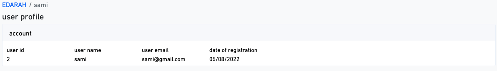
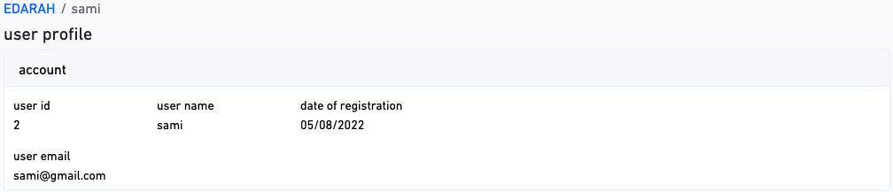
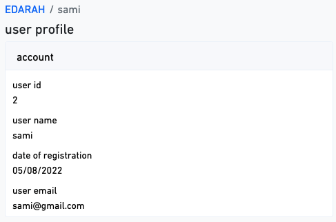
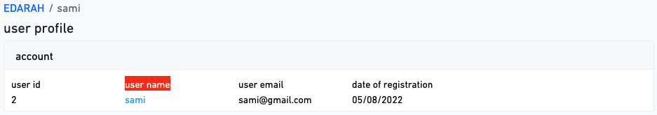
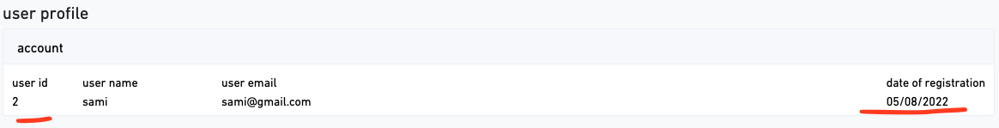
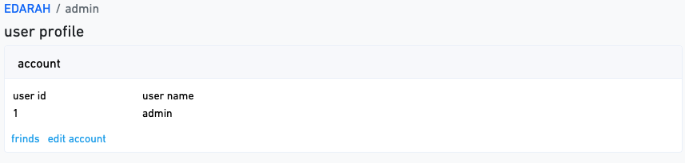

# Card container

we have card container in ` resources/vue/Admin/Containers/Shared/Card.vue`
help you to desplay your items

## content

-   [minimum usage](#minimum-usage)
-   [card structure](#card-structure)
-   [item title color](#item-title-color)
-   [item options](#item-options)
-   [card actions](#card-actions)

### Minimum usage

first create action in `App/Actions/Admin` for example `UsersInfo.php` \
then import UsersInfo.php in controller for example

```php
//UserController.php
  use App\Actions\Admin\UsersInfo; // import UsersInfo class

       public function show( User $user)
    {

  $usersInfo = [
            'title' => 'user profile ', // container title
            'container' => 'Card', // container component
            'payload' => UsersInfo::payload($user), // payload of Card container
        ];

        return Inertia::render('Page', [
            'title' => $user->name, // page title
            'containers' => [$usersInfo],

        ]);

    }

```

in UsersInfo calss return Card payload

```php
 <?php

namespace App\Actions\Admin;


class UsersInfo
{

     public static function payload($user)
    {


        $items = [
            [
                'key' => 'user-id',
                'displayName' => 'user id',
                'component' => 'Text',// resources/vue/Admin/Components/Shared/Text.vue
                'payload' => $user->id, // payload of Text component
            ],
            [
                'key' => 'user-name',
                'displayName' => 'user name',
                'component' => 'Text',// resources/vue/Admin/Components/Shared/Text.vue
                'payload' => $user->name, // payload of Text component
            ],
            [
                'key' => 'user-email',
                'displayName' => 'user email',
                'component' => 'Text',
                'payload' => $user->email,

            ],
            [
                'key' => 'created-at',
                'displayName' => 'date of registration',
                'component' => 'Text',
                'payload' => $user->created_at,
            ],
        ];

        return [
            'cardTitle' => 'account',
            'items' => $items,
            'structure' => [
                        // items keys
                    ['user-id','user-name','user-email','created-at'],
            ],
        ];
    }
}

```

now see output in `http://127.0.0.1:8000/admin/users/2`

<p align="center">
     
</p>

### card structure

(required) for Select the structure of the card as rows

you can make some item in next row like this :

```php
'structure' => [
                   // items keys
                    ['user-id','user-name','created-at'], // first row
                    ['user-email'] // secend row

            ]
```

output :

<p align="center">
     
</p>

on small screens automatically Each item will be displayed in a row individually

<p align="center">
     
</p>

### item title color

you can make item displayName value as array to pass css class

```php

 'displayName' => ['user name',' text-white bg-danger'],

```

output :

<p align="center">
     
</p>

### item options

any item have tow options

-   pushToEnd
-   minWidth

for example :

```php
               [
                    'key' => 'user-id',
                    'displayName' => 'user id',
                    'component' => 'Text',
                    'payload' => $user->id,
                    'options' => [ // (optional)
                        'minWidth' => 70, // default is 150px
                    ],
                ],
               [
                    'key' => 'created-at',
                    'displayName' => 'date of registration',
                    'component' => 'Text',
                    'payload' => $user->created_at->format('d/m/Y'),
                    'options' => [ // (optional)
                        'minWidth' => 70,  // default is 150px
                        'pushToEnd' => true,
                    ],
                ],

```

output :

<p align="center">
     
</p>

### card actions

you can add action for your model example , delete edit , or any action
for example :

```php
<?php

namespace App\Actions\Admin;


class UsersInfo
{

    public static function payload($user)
    {
        $items = [
            [
                'key' => 'user-id',
                'displayName' => 'user id',
                'component' => 'Text',
                'payload' => $user->id,

            ],
            [
                'key' => 'user-name',
                'displayName' => 'user name',
                'component' =>'Text',
                'payload' => $user->name,
            ],
        ];

        return [
            'cardTitle' => 'account',
            'items' => $items,
            'actions' => [
                // actions
                [
                    'title' => 'friends',
                    'route' => route('admin.users.friends', $user->id ),
                    'type' => 'post', //  (optional) route type ( post, put, patch , delete) The default is get.
                ],
                [
                    'title' => 'edit account',
                    'route' => route('admin.users.edit', $user->id ),
                ],

            ],
            'structure' => [

                    ['user-id','user-name'],

            ],
        ];
    }
}
```

output :

<p align="center">
     
</p>

if the action url to external app
replace key `route` to ` url`

```php

 'actions' => [
               // actions
               [
                   'title' => 'frinds',
                   'route' => route('admin.users.edit', $user->id ),
               ],
               [
                   'title' => 'go to  laravel ',
                   'url' => 'https://laravel.com', // url
               ],

           ],

```

also you can change action title color like this :\
make action `title` as array too pass css text class

```php
                [
                    'title' => ['edit account','text-warning'], // or any text class (default is text-primary )
                    'route' => route('admin.users.edit', $user->id ),
                ],
```

if you want action with modal confirm
just pass to action `withConfirm`

```php
            // actions
               [
                   'title' => [' delete ','text-danger'],
                   'route' => route('admin.users.destroy', $user->id ),
                   'type' => 'delete',
                   'withConfirm'=> [
                       'msg' => 'are you shore for delete '.$user->name.'?', // msg (required)
                       'buttonClass' => 'btn-warning text-white' // button Confirm class (optional) default is class btn-danger text-white
                   ],
               ],
```
